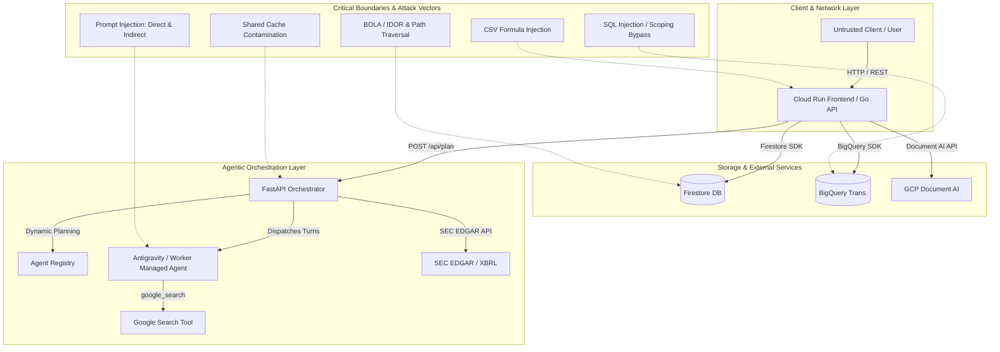

# Runtime Security Threat Model & Hardening Plan: Portfolio Copilot

**Document Version:** 1.1.0  
**Target Repository:** `portfolio-copilot`  
**Classification:** Security Assessment & Engineering Hardening Plan  
**Status:** In Progress (Phase 1 & Phase 2 Complete)  

---

## 1. Executive Summary & Threat Landscape

Portfolio Copilot is an agentic personal finance assistant featuring registry-driven dynamic planning on the Gemini Enterprise Agent Platform. It combines non-deterministic LLM-driven components (Root Planner, Managed Worker Agents) with deterministic execution layers (Go web API, Python financial primitives, BigQuery analytical storage, and Firestore state management).

This security evaluation audits the runtime attack surface against OWASP Top 10 for LLM Applications and OWASP API Security Top 10. The system demonstrates good defensive architecture in its core execution flow (deterministic trade calculations and deterministic rule validation in the Reviewer). Critical vulnerabilities in natural language SQL scoping and prompt boundary isolation have been mitigated in **Phase 1** and **Phase 2**. Additional hardening for multi-tenant data isolation, session identity, and file ingestion remains scheduled for **Phases 3 and 4**.



---

## 2. Comprehensive Attack Vector Breakdown

### Vector 1: Prompt Injection & Adversarial AI Attacks

#### 1.1 Direct Prompt Injection (Jailbreaking & Instruction Override)
* **Code Reference:** [`orchestrator/src/orchestrator/managed_agents/dispatcher.py:L343-L398`](file:///usr/local/google/home/srinandans/workspace/portfolio-copilot/orchestrator/src/orchestrator/managed_agents/dispatcher.py#L343-L398)
* **Vulnerability Mechanism:**  
  Previously, `_build_worker_prompt` constructed the worker prompt by concatenating system preamble, registry skill instructions, JSON schema, and payload as unescaped raw strings. Adversarial text in payloads could escape prompt boundaries.
* **Status:** **Mitigated (Phase 2 / ADR-0030)** via XML delimiter framing (`<skill_instructions>`, `<output_schema>`, `<untrusted_input>`), closing-tag escaping (`</untrusted_input>` &rarr; `&lt;/untrusted_input&gt;`), and anti-exploration preamble framing.

#### 1.2 Indirect Prompt Injection via Untrusted External Data
* **Code Reference:** [`orchestrator/src/orchestrator/managed_agents/dispatcher.py:L51-L57`](file:///usr/local/google/home/srinandans/workspace/portfolio-copilot/orchestrator/src/orchestrator/managed_agents/dispatcher.py#L51-L57), [`orchestrator/src/orchestrator/executors/sec_edgar.py`](file:///usr/local/google/home/srinandans/workspace/portfolio-copilot/orchestrator/src/orchestrator/executors/sec_edgar.py)
* **Vulnerability Mechanism:**  
  The `research` skill equips the worker agent with `google_search`. Malicious third-party web pages, SEC filing footnotes, or transaction descriptions could inject adversarial context.
* **Defense-in-Depth:** Sizing and ticker selection are computed deterministically in [`primitives/portfolio_analysis.py`](file:///usr/local/google/home/srinandans/workspace/portfolio-copilot/orchestrator/src/orchestrator/primitives/portfolio_analysis.py) and verified by [`reviewer/rules.py`](file:///usr/local/google/home/srinandans/workspace/portfolio-copilot/orchestrator/src/orchestrator/reviewer/rules.py). The LLM cannot unilaterally increase trade amounts or choose excluded tickers.

#### 1.3 Policy & Constraint Manipulation via Goals Onboarding
* **Code Reference:** [`orchestrator/src/orchestrator/contracts/goals_onboarding.py`](file:///usr/local/google/home/srinandans/workspace/portfolio-copilot/orchestrator/src/orchestrator/contracts/goals_onboarding.py), [`orchestrator/src/orchestrator/contracts/ips.py`](file:///usr/local/google/home/srinandans/workspace/portfolio-copilot/orchestrator/src/orchestrator/contracts/ips.py)
* **Vulnerability Mechanism:**  
  During onboarding interview, adversarial input could attempt to produce an unconstrained or extreme IPS policy.
* **Status:** **Mitigated (integrity floor — issue #355).** A fail-closed constraint floor on the IPS contracts (`orchestrator/contracts/ips.py`) makes a defanged-but-schema-valid policy non-constructable: `concentration_limit_percent` must be within `5..50` (a bare `0..100` range is not a guardrail — it was the gap this closes), target allocations must sum to ~100% (±1), and no single allocation band may span more than 50 points (so `min=0,max=100` is rejected). These combine with the pre-existing `time_horizon_years: 0..100` bound, band-direction validation (`min <= target <= max`), and uppercase/whitespace sanitization on ticker exclusions. Enforced at construction on both `InvestmentPolicyStatement` and `GoalsOnboardingResult`, so a corrupted IPS is rejected regardless of source; regression tests in `orchestrator/tests/contracts/test_ips_integrity.py`.
* **Cross-language:** the same floor is mirrored in Go (`InvestmentPolicyStatement.ValidateIntegrity()` in `pkg/contracts/ips.go`) and enforced on the direct document-upload path (`POST /api/documents`, `document_type=ips` in `frontend/server/handlers.go`, returning 400), so an uploaded IPS is held to the identical bounds. The Go and Python constants must stay in lockstep (tracked with #312 on unifying the duplicated contracts).

---

### Vector 2: SQL Injection & BigQuery Data Layer Attacks

#### 2.1 User Scoping Bypass in Natural Language SQL
* **Code Reference:** [`orchestrator/src/orchestrator/data/bigquery.py:L33-L88`](file:///usr/local/google/home/srinandans/workspace/portfolio-copilot/orchestrator/src/orchestrator/data/bigquery.py#L33-L88)
* **Vulnerability Mechanism:**  
  Naive substring checking for `@user_id` allowed queries like `WHERE user_id = @user_id OR 1=1` or comments to bypass user row scoping.
* **Status:** **Mitigated (Phase 1 / ADR-0029)** via `prepare_secure_sql` implementing CTE-based table shadowing (`WITH {table} AS (SELECT * FROM ... WHERE user_id = @user_id)`), project qualifier stripping, read-only SELECT enforcement, and an automatic `LIMIT 100` guardrail.

#### 2.2 Metadata & Catalog Table Exposure
* **Code Reference:** [`orchestrator/src/orchestrator/data/bigquery.py:L56-L58`](file:///usr/local/google/home/srinandans/workspace/portfolio-copilot/orchestrator/src/orchestrator/data/bigquery.py#L56-L58)
* **Vulnerability Mechanism:**  
  Queries joining `INFORMATION_SCHEMA` or system views could enumerate schema and infrastructure.
* **Status:** **Mitigated (Phase 1 / ADR-0029)** by explicitly detecting and rejecting `INFORMATION_SCHEMA` queries and requiring queries to target authorized transaction tables.

---

### Vector 3: Storage & Access Control (Firestore / API / BOLA)

#### 3.1 Broken Object-Level Authorization (BOLA / IDOR)
* **Code Reference:** [`frontend/server/handlers.go`](file:///usr/local/google/home/srinandans/workspace/portfolio-copilot/frontend/server/handlers.go), [`pkg/store/reads.go`](file:///usr/local/google/home/srinandans/workspace/portfolio-copilot/pkg/store/reads.go), [`pkg/store/crud.go`](file:///usr/local/google/home/srinandans/workspace/portfolio-copilot/pkg/store/crud.go)
* **Vulnerability Mechanism:**  
  The Go backend handlers and store methods accept user IDs without validating format or bounding access.
* **Status:** **Mitigated (Phase 3 / ADR-0031)** with strict identifier regex validation (`^[a-zA-Z0-9_-]{1,64}$`) at both API gateway handlers (returning 400 Bad Request) and storage client layers.

#### 3.2 Firestore Document Path Traversal
* **Code Reference:** [`orchestrator/src/orchestrator/data/firestore.py`](file:///usr/local/google/home/srinandans/workspace/portfolio-copilot/orchestrator/src/orchestrator/data/firestore.py), [`pkg/store/client.go`](file:///usr/local/google/home/srinandans/workspace/portfolio-copilot/pkg/store/client.go)
* **Vulnerability Mechanism:**  
  Unvalidated `user_id` containing `/` or relative paths could access unintended subcollections.
* **Status:** **Mitigated (Phase 3 / ADR-0031)** via `validate_user_id` in Python and `ValidateUserID` in Go, preventing path traversal characters (`/`, `..`, `\`) from reaching document reference constructors.

#### 3.3 Cross-Session In-Memory Cache Contamination
* **Code Reference:** [`orchestrator/src/orchestrator/managed_agents/dispatcher.py:L37-L49`](file:///usr/local/google/home/srinandans/workspace/portfolio-copilot/orchestrator/src/orchestrator/managed_agents/dispatcher.py#L37-L49)
* **Vulnerability Mechanism:**  
  Global `_RESEARCH_CACHE` keyed purely on query text could serve cross-session results across different user boundaries.
* **Status:** **Mitigated (Phase 3 / ADR-0031)** by namespacing research cache entries with validated user IDs (`{user_id}:{normalized_query}`).

---

### Vector 4: Ingestion, File Parsing & Web Exploits

#### 4.1 CSV Formula / DDE Injection
* **Code Reference:** [`frontend/server/handlers.go:L422-L460`](file:///usr/local/google/home/srinandans/workspace/portfolio-copilot/frontend/server/handlers.go#L422-L460)
* **Vulnerability Mechanism:**  
  Ingested transaction descriptions from CSV uploads starting with formula triggers (`=`, `+`, `-`, `@`) could execute unauthorized actions when exported.
* **Status:** **Pending (Phase 4)**.

---

## 3. Vulnerability Severity Matrix

| ID | Vulnerability | Surface | Severity | CVSS v3.1 | Status |
| :--- | :--- | :--- | :--- | :--- | :--- |
| **SEC-01** | NL SQL User Scoping Bypass | BigQuery / Python Data Layer | **Critical** | 8.6 | **Completed (ADR-0029)** |
| **SEC-02** | Unauthenticated BOLA / IDOR | Go Gateway API Handlers | **High** | 7.5 | **Mitigated (Phase 3 / ADR-0031)** |
| **SEC-03** | Prompt Boundary Delimiter Escape | Worker Managed Agent Dispatcher | **High** | 7.3 | **Completed (ADR-0030)** |
| **SEC-04** | IPS Policy Manipulation via Interview | Goals Onboarding Extraction | **High** | 7.1 | **Completed (integrity floor, #355)** — enforced in both Python and Go contracts |
| **SEC-05** | Shared Process Cache Contamination | Research Worker Memory Cache | **Medium** | 5.8 | **Mitigated (Phase 3 / ADR-0031)** |
| **SEC-06** | Firestore Path Traversal via User ID | Firestore Storage Client | **Medium** | 5.3 | **Mitigated (Phase 3 / ADR-0031)** |
| **SEC-07** | Information Schema Catalog Exposure | BigQuery NL SQL Validation | **Medium** | 4.9 | **Completed (ADR-0029)** |
| **SEC-08** | CSV Formula Injection (DDE) | Document Ingestion Handler | **Low** | 3.5 | Pending (Phase 4) |

---

## 4. Hardening & Remediation Plan

```
                              IMPLEMENTATION ROADMAP
  ┌─────────────────────────────────────────────────────────────────────────┐
  │ [x] PHASE 1: SQL & Data Layer Isolation (Completed)                     │
  │ • Port Go CTE-based query rewriting to Python orchestrator              │
  │ • Enforce read-only SELECT, keyword blocking & INFORMATION_SCHEMA ban   │
  │ • Strip qualified dataset names & auto-inject LIMIT 100                 │
  │ • Documented in ADR-0029                                                │
  ├─────────────────────────────────────────────────────────────────────────┤
  │ [x] PHASE 2: Prompt Boundary & Agent Hardening (Completed)              │
  │ • Implement XML delimiter framing (<untrusted_input>) with escaping     │
  │ • Add anti-exploration & passive-data preambles for Managed Agents      │
  │ • Enforce strict validation bounds on generated IPS constraints & goals │
  │ • Documented in ADR-0030                                                │
  ├─────────────────────────────────────────────────────────────────────────┤
  │ [x] PHASE 3: Storage, Identity & Cache Isolation (Completed)            │
  │ • Sanitize user_id with regex ^[a-zA-Z0-9_-]{1,64}$                     │
  │ • Enforce BOLA / IDOR validation across Go handlers and store layers    │
  │ • Namespace _RESEARCH_CACHE by tenant/user_id in dispatcher             │
  │ • Documented in ADR-0031                                                │
  ├─────────────────────────────────────────────────────────────────────────┤
  │ [ ] PHASE 4: File Ingestion & Output Sanitization (Pending / P2)        │
  │ • Sanitize CSV cells starting with formula symbols                      │
  │ • Add rate-limiting on Document AI parsing endpoints                    │
  └─────────────────────────────────────────────────────────────────────────┘
```

### Phase 1: BigQuery Scoping & SQL Hardening — [x] COMPLETED
- **Implementation:** [`orchestrator/src/orchestrator/data/bigquery.py`](file:///usr/local/google/home/srinandans/workspace/portfolio-copilot/orchestrator/src/orchestrator/data/bigquery.py#L33-L88)
- **ADR Reference:** [`docs/adr/0029-bigquery-sql-scoping-and-hardening.md`](file:///usr/local/google/home/srinandans/workspace/portfolio-copilot/docs/adr/0029-bigquery-sql-scoping-and-hardening.md)
- **Verification:** Unit test suite in `orchestrator/tests/data/test_bigquery.py` verifying CTE shadowing, keyword blocking, and user parameter isolation.

### Phase 2: Prompt Framing & Delimiter Isolation — [x] COMPLETED
- **Implementation:** [`orchestrator/src/orchestrator/managed_agents/dispatcher.py`](file:///usr/local/google/home/srinandans/workspace/portfolio-copilot/orchestrator/src/orchestrator/managed_agents/dispatcher.py#L343-L398), [`orchestrator/src/orchestrator/contracts/ips.py`](file:///usr/local/google/home/srinandans/workspace/portfolio-copilot/orchestrator/src/orchestrator/contracts/ips.py), [`orchestrator/src/orchestrator/contracts/goals_onboarding.py`](file:///usr/local/google/home/srinandans/workspace/portfolio-copilot/orchestrator/src/orchestrator/contracts/goals_onboarding.py)
- **ADR Reference:** [`docs/adr/0030-prompt-delimiter-framing-and-isolation.md`](file:///usr/local/google/home/srinandans/workspace/portfolio-copilot/docs/adr/0030-prompt-delimiter-framing-and-isolation.md)
- **Verification:** Unit test suite in `orchestrator/tests/test_managed_agents.py` and `orchestrator/tests/primitives/test_goals_onboarding_logic.py`.

### Phase 3: Identity Validation & Storage Isolation — [x] COMPLETED
- **Implementation:** [`orchestrator/src/orchestrator/data/validation.py`](file:///usr/local/google/home/srinandans/workspace/portfolio-copilot/orchestrator/src/orchestrator/data/validation.py), [`orchestrator/src/orchestrator/data/firestore.py`](file:///usr/local/google/home/srinandans/workspace/portfolio-copilot/orchestrator/src/orchestrator/data/firestore.py), [`orchestrator/src/orchestrator/managed_agents/dispatcher.py`](file:///usr/local/google/home/srinandans/workspace/portfolio-copilot/orchestrator/src/orchestrator/managed_agents/dispatcher.py), [`pkg/store/client.go`](file:///usr/local/google/home/srinandans/workspace/portfolio-copilot/pkg/store/client.go), [`pkg/store/reads.go`](file:///usr/local/google/home/srinandans/workspace/portfolio-copilot/pkg/store/reads.go), [`pkg/store/crud.go`](file:///usr/local/google/home/srinandans/workspace/portfolio-copilot/pkg/store/crud.go), [`pkg/bigquery/bigquery.go`](file:///usr/local/google/home/srinandans/workspace/portfolio-copilot/pkg/bigquery/bigquery.go), [`frontend/server/handlers.go`](file:///usr/local/google/home/srinandans/workspace/portfolio-copilot/frontend/server/handlers.go), [`frontend/server/analysis.go`](file:///usr/local/google/home/srinandans/workspace/portfolio-copilot/frontend/server/analysis.go), [`frontend/server/plan.go`](file:///usr/local/google/home/srinandans/workspace/portfolio-copilot/frontend/server/plan.go), [`frontend/server/onboarding.go`](file:///usr/local/google/home/srinandans/workspace/portfolio-copilot/frontend/server/onboarding.go)
- **ADR Reference:** [`docs/adr/0031-storage-identity-and-cache-isolation.md`](file:///usr/local/google/home/srinandans/workspace/portfolio-copilot/docs/adr/0031-storage-identity-and-cache-isolation.md)
- **Verification:** Unit test suites in `orchestrator/tests/data/test_validation.py`, `orchestrator/tests/data/test_firestore_security.py`, `pkg/store/validation_test.go`, `pkg/bigquery/bigquery_test.go`, and `frontend/server/handlers_test.go`.

### Phase 4: Ingestion Sanitization — [ ] PENDING
- **Target File:** [`frontend/server/handlers.go`](file:///usr/local/google/home/srinandans/workspace/portfolio-copilot/frontend/server/handlers.go)
- **Planned Work:**
  1. CSV formula prefix escaping (`=`, `+`, `-`, `@` &rarr; `'=`, `'+`, etc.).
  2. Document AI upload rate limiting.

---

## 5. Verification & Security Testing Strategy

### Unit & Integration Security Test Suite
1. **SQL Injection Tests (`orchestrator/tests/data/test_bigquery.py`):** Verified CTE shadowing and scoping bypass rejection.
2. **Prompt Boundary Tests (`orchestrator/tests/test_managed_agents.py`):** Verified XML tag escaping and delimiter isolation.
3. **Identifier Traversal & Storage Tests (`orchestrator/tests/data/test_validation.py`, `orchestrator/tests/data/test_firestore_security.py`, `pkg/store/validation_test.go`, `frontend/server/handlers_test.go`):** Verified path traversal rejection, strict format enforcement, and tenant cache isolation.
4. **CSV Ingestion Tests (`frontend/server/handlers_test.go`):** (Phase 4).
