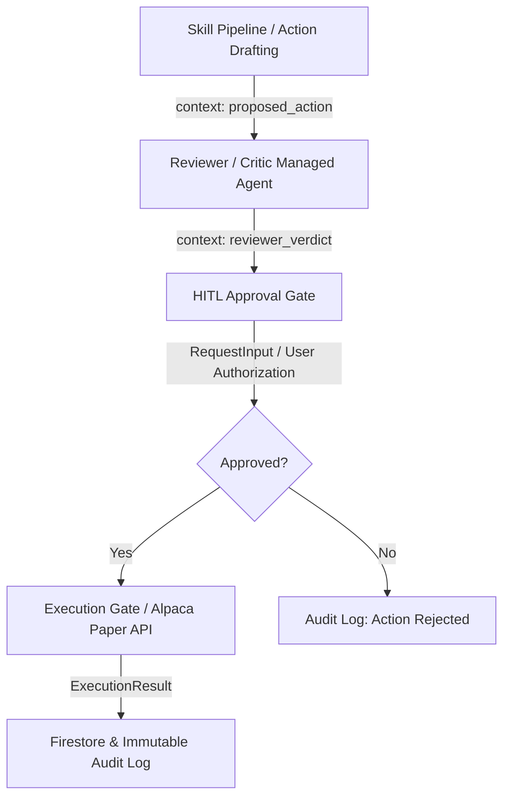

# Architecture

This document describes how the system is built, reflecting the completed Phase 4 architecture including sub-agent execution via Managed Agents and the three-stage Governance layer (Reviewer → HITL Gate → Execution Gate). For what it does, see [`01-functional.md`](01-functional.md). For the reasoning behind each decision below, see the linked ADRs.

## Stack summary

| Layer | Choice | ADR |
|---|---|---|
| Agent implementation | **Python**, ADK dynamic workflows | [0008](../adr/0008-python-for-orchestrator.md) (supersedes [0001](../adr/0001-go-over-python-for-agents.md)) |
| Root orchestration | ADK `DynamicNode` / Workflow orchestrator | [0004](../adr/0004-dynamic-planning-over-fixed-pipeline.md) |
| Sub-agent execution layer | Managed Agents API (Antigravity worker agent + per-interaction SKILL.md override) | [0014](../adr/0014-managed-agents-subagent-execution-layer.md) (supersedes [0005](../adr/0005-managed-agents-hybrid-evaluation.md)), [0007](../adr/0007-skill-content-via-input-not-mounting.md), [0009](../adr/0009-managed-agent-native-class.md) |
| Governance & safety | Reviewer/Critic Managed Agent → HITL Approval Gate (`RequestInput`) → Alpaca Execution Gate | [0014](../adr/0014-managed-agents-subagent-execution-layer.md), [0015](../adr/0015-real-user-data-antigravity-sandbox.md) |
| Deterministic math & primitives | In-process Python functions under `orchestrator/primitives/` | [0016](../adr/0016-deterministic-primitives-in-orchestrator.md) |
| Analytical data | BigQuery (Chase transactions) | [0002](../adr/0002-bigquery-plus-firestore-split.md), [0015](../adr/0015-real-user-data-antigravity-sandbox.md) |
| Transactional data | Firestore (IPS, holdings, liabilities, audit log) — separate Go and Python clients | [0002](../adr/0002-bigquery-plus-firestore-split.md), [0008](../adr/0008-python-for-orchestrator.md) |
| Session state | Vertex AI Sessions | — |
| Long-term memory | Vertex AI Memory Bank | — |
| Deployment / runtime | Vertex AI Agent Runtime (Agent Engine) — Python custom-agent contract | [0008](../adr/0008-python-for-orchestrator.md) |
| Deployment identities | Dedicated Cloud Run SAs (`portfolio-copilot-gateway-sa`, `portfolio-copilot-frontend-sa`) + Agent Identity (`orchestrator`) | [0011](../adr/0011-least-privilege-identities.md) |
| Frontend | TypeScript + Vue.js, Cloud Run | [0003](../adr/0003-standalone-ui-not-agentspace.md) |
| API gateway | **Go** (unaffected by the Python pivot — not an agent), Cloud Run | [0003](../adr/0003-standalone-ui-not-agentspace.md), [0008](../adr/0008-python-for-orchestrator.md) |
| Trade execution (paper) | Alpaca API (orchestrator-owned execution outside sandbox) | [0005](../adr/0005-managed-agents-hybrid-evaluation.md), [0014](../adr/0014-managed-agents-subagent-execution-layer.md) |

## Data layer

**BigQuery** — Chase transaction data only. Chosen specifically so Spending
Analysis can showcase NL-to-SQL analytics (trend/aggregation questions),
which Firestore's point-read model doesn't support well.

**Firestore** — everything transactional and structural: the IPS document,
portfolio holdings, current liabilities, and the approval/audit log.
Needs millisecond reads, real transactional writes, and row-level
concurrency control — none of which BigQuery is built for.

**Vertex AI Memory Bank** — long-term *soft* memory: preferences, summarized
past interactions, semantic recall (e.g. "rejected trimming AAPL in
March"). Not a substitute for a database — it doesn't hold bulk structured
data.

## Deployment topology

```
Frontend (Vue, Cloud Run)
        │
        ▼
API Gateway (Go, Cloud Run) — auth, streaming, fan-out reads
        │
        ▼
Root Orchestrator (Python, ADK, Agent Runtime)
  ├─ queries Agent Registry at runtime
  ├─ composes plan (sequence of Managed Agent invocations)
  ├─ for each skill:
  │    ├─ resolves SKILL.md from registry
  │    ├─ pre-fetches state (Firestore reads, BigQuery reads)
  │    ├─ pre-computes derived values via primitives/*.py
  │    └─ invokes worker Managed Agent via ADK ManagedAgent class,
  │       passing pre-computed inputs + SKILL.md as description
  ├─ collects typed output (DriftReport, ProposedAction, ResearchBrief,
  │    ReviewerVerdict, GoalsOnboardingResult, SpendingReport)
  ├─ invokes Reviewer Managed Agent on any drafted ProposedAction
  ├─ owns HITL gate (RequestInput)
  ├─ writes state (IPS, ProposedAction, audit log)
  └─ owns Alpaca execution
        │
        └──── Interactions API ────►  Worker Managed Agent (Antigravity)
                                        └─ google_search (research skill only)

primitives/ (Python, in-process to orchestrator):
  - calculate_drift(holdings, ips)      -> DriftReport
  - calculate_draft_action(...)         -> ProposedAction | None
  - is_anomalous(current, avg)          -> bool
  - calculate_savings_rate(...)         -> float
  - calculate_reserve_months(...)       -> float
  - calculate_risk_tolerance(...)       -> RiskTolerance
```

The frontend is a standalone custom UI, not built on Gemini
Enterprise/Agentspace — see [ADR-0003](../adr/0003-standalone-ui-not-agentspace.md)
for why. All Cloud Run services are deployed with `--no-allow-unauthenticated`,
with IAM-authenticated invocation granted from the frontend service account to the gateway
([ADR-0013](../adr/0013-authenticated-cloud-run.md)).

## Deployment identities

Every deployed component operates under a least-privilege, scoped identity (see [ADR-0011](../adr/0011-least-privilege-identities.md) and [ADR-0013](../adr/0013-authenticated-cloud-run.md)):
- **`portfolio-copilot-gateway-sa`** (Cloud Run): Granted `roles/datastore.user` (Firestore audit log + holdings) and `roles/bigquery.dataViewer` (fan-out chart queries). Does not have Secret Manager access.
- **`portfolio-copilot-frontend-sa`** (Cloud Run): Dedicated service account with `roles/run.invoker` on the gateway service (communicates strictly with the Gateway API via authenticated IAM tokens).
- **`orchestrator` Agent Identity** (Agent Runtime): Uses SPIFFE-based per-agent cryptographic identity with `roles/datastore.user`, `roles/bigquery.dataViewer`, and `roles/secretmanager.secretAccessor` (Alpaca API credentials and `MANAGED_AGENT_ID`). The Agent Platform Service Agent holds deployment-time secret accessor permissions.

## Language

**Python for the orchestrator, primitives, and skill metadata; Go for the gateway.**
Agent Runtime's deployment contract is Python-only, while the API gateway remains in Go as a high-performance, stateless proxy. See [ADR-0008](../adr/0008-python-for-orchestrator.md).

## Lifecycle

Follows the full ADK lifecycle: **define** (agent cards, tool contracts,
approval schema) → **build** → **evaluate** (scenario + adversarial eval
set) → **deploy** (Agent Engine) → **observe** (traces feed the governance
layer).

## Sub-agent execution: Managed Agents

All sub-agents execute as Managed Agents via the Interactions API using a unified worker agent (`portfolio-copilot-worker`), customized per-interaction with registry-resolved `SKILL.md` instructions and pre-computed inputs from in-process primitives ([ADR-0014](../adr/0014-managed-agents-subagent-execution-layer.md), [ADR-0015](../adr/0015-real-user-data-antigravity-sandbox.md), [ADR-0016](../adr/0016-deterministic-primitives-in-orchestrator.md)).

## Governance layer

The governance layer enforces safety, policy compliance, and human oversight before any proposed financial action is executed. It executes in a strict three-stage sequence after the dynamic skill pipeline completes:



### 1. Reviewer / Critic Managed Agent
When a `ProposedAction` is drafted (e.g., a rebalancing trade), the **Reviewer/Critic Managed Agent** (`reviewer`) is invoked to independently audit the proposal against the user's Investment Policy Statement (IPS) and deterministic risk rules ([ADR-0014](../adr/0014-managed-agents-subagent-execution-layer.md), [ADR-0015](../adr/0015-real-user-data-antigravity-sandbox.md)). It returns a structured `ReviewerVerdict` (`APPROVED`, `REJECTED`, or `NEEDS_REVISION`) along with an audit rationale and risk score.

### 2. Human-in-the-Loop (HITL) Approval Gate
Following the Reviewer, the **HITL approval gate** (`gates/hitl.py`) suspends workflow execution via `RequestInput`. It surfaces the `ProposedAction` and the independent `ReviewerVerdict` to the user in the frontend UI. No financial action can bypass explicit human authorization.

### 3. Execution Gate
Once explicitly approved by the user, the **Execution gate** (`gates/execution.py`) invokes the `AlpacaExecutor` (`executors/alpaca.py`) to submit the order to Alpaca's paper-trading API. The broker order ID, execution timestamp, and final status are recorded in Firestore and emitted to the immutable audit log.
