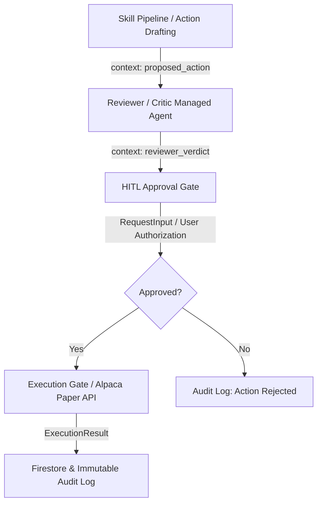

# Architecture

This document describes how the system is built, reflecting the completed Phase 4 architecture including intent-driven plan construction ([ADR-0022](../adr/0022-intent-driven-skill-planning.md)), sub-agent execution via Managed Agents, and the three-stage Governance layer (Reviewer → HITL Gate → Execution Gate). For what it does, see [`01-functional.md`](01-functional.md). For the reasoning behind each decision below, see the linked ADRs.

## Stack summary

| Layer | Choice | ADR |
|---|---|---|
| Agent implementation | **Python**, ADK dynamic workflows | [0008](../adr/0008-python-for-orchestrator.md) (supersedes [0001](../adr/0001-go-over-python-for-agents.md)) |
| Root orchestration | ADK `DynamicNode` / Workflow orchestrator; intent-driven plan construction (Retrieve → Plan → Resolve → Schedule) | [0004](../adr/0004-dynamic-planning-over-fixed-pipeline.md), [0022](../adr/0022-intent-driven-skill-planning.md) |
| Sub-agent execution layer | Managed Agents API (Antigravity worker agent + per-interaction SKILL.md override) | [0014](../adr/0014-managed-agents-subagent-execution-layer.md) (supersedes [0005](../adr/0005-managed-agents-hybrid-evaluation.md)), [0007](../adr/0007-skill-content-via-input-not-mounting.md), [0009](../adr/0009-managed-agent-native-class.md) |
| Governance & safety | Reviewer/Critic Managed Agent → HITL Approval Gate (`RequestInput`) → Alpaca Execution Gate | [0014](../adr/0014-managed-agents-subagent-execution-layer.md), [0015](../adr/0015-real-user-data-antigravity-sandbox.md) |
| Deterministic math & primitives | In-process Python functions under `orchestrator/primitives/` | [0016](../adr/0016-deterministic-primitives-in-orchestrator.md) |
| Analytical data | BigQuery (Checking transactions) | [0002](../adr/0002-bigquery-plus-firestore-split.md), [0015](../adr/0015-real-user-data-antigravity-sandbox.md) |
| Transactional data | Firestore (IPS, holdings, liabilities, audit log) — separate Go and Python clients | [0002](../adr/0002-bigquery-plus-firestore-split.md), [0008](../adr/0008-python-for-orchestrator.md) |
| Session state | Agent Platform Sessions | — |
| Long-term memory | Agent Platform Memory Bank | — |
| Deployment / runtime | Agent Platform Agent Runtime — Python custom-agent contract | [0008](../adr/0008-python-for-orchestrator.md) |
| Deployment identities | Dedicated Cloud Run SA (`portfolio-copilot-frontend-sa`) + Agent Identity (`orchestrator`) | [0011](../adr/0011-least-privilege-identities.md), [0017](../adr/0017-unified-gateway-and-frontend.md) |
| Web application | Vue 3 + TypeScript SPA hosted by Go backend server (`frontend/server`), Cloud Run | [0003](../adr/0003-standalone-ui-not-agentspace.md), [0017](../adr/0017-unified-gateway-and-frontend.md) |
| Trade execution (paper) | Alpaca API (orchestrator-owned execution outside sandbox) | [0005](../adr/0005-managed-agents-hybrid-evaluation.md), [0014](../adr/0014-managed-agents-subagent-execution-layer.md) |

## Data layer

**BigQuery** — Checking transaction data only. Chosen specifically so Spending
Analysis can showcase NL-to-SQL analytics (trend/aggregation questions),
which Firestore's point-read model doesn't support well.

**Firestore** — everything transactional and structural: the IPS document,
portfolio holdings, current liabilities, user profile demographics, uploaded
documents metadata, baseline reports, and the approval/audit log.
Needs millisecond reads, real transactional writes, and row-level
concurrency control — none of which BigQuery is built for.

**Agent Platform Sessions** — short-term conversation and workflow state (`ctx.state` and ADK session history). All values stored in `ctx.state` across workflow resumptions (such as `hitl_action`, `hitl_verdict`, and `last_authorized_skills`) MUST be strictly JSON-serializable dictionaries (`json.dumps(...)` compatible). Unlike `InMemorySessionService`, Agent Platform Session service enforces JSON serialization invariants and size constraints; storing raw Python objects, Pydantic model instances, or non-serializable datetimes in `ctx.state` will result in runtime serialization exceptions upon checkpointing or resuming.

**Agent Platform Memory Bank** — long-term *soft* memory: preferences, summarized
past interactions, semantic recall (e.g. "rejected trimming AAPL in
March"). Not a substitute for a database — it doesn't hold bulk structured
data.

## System architecture diagram

```mermaid
flowchart TD
    subgraph Client ["Client Layer"]
        UI["Vue 3 + TypeScript SPA<br/><i>(Dashboard, Portfolio Drift, Spending, Profile & Policy Hub, Documents Ingestion, Onboarding Wizard, HITL Card)</i>"]
    end

    subgraph WebHost ["Web Host & API Gateway (Cloud Run)"]
        Server["Go Backend Server<br/><code>frontend/server</code> (:8080)"]
        SPA["Static Asset Host<br/><code>/dist</code>"]
        APIProxy["REST & SSE Streaming Gateway<br/><code>/api/{plan,holdings,spending_report,drift_report,profile,documents,onboarding,telemetry}</code>"]
        Server --> SPA
        Server --> APIProxy
    end

    subgraph AgentRuntimeLayer ["Agent Platform Agent Runtime (Cloud Custom Container)"]
        Planner["Root Intent-Driven Planner<br/><code>orchestrator.planner:root_agent</code><br/><i>(ADK DynamicNode / Workflow)</i>"]
        
        subgraph OrchestratorLoop ["Intent-Driven Planning & Governance Loop"]
            Discovery["1. Retrieve — skills + manifests<br/><code>registry_client.py</code>, <code>planning/retrieval.py</code>"]
            PlanStage["2. Plan — intent + policy select leaves<br/><code>planning/intent.py</code>, <code>planning/policy.py</code>"]
            Schedule["3. Resolve + Schedule — dependency graph → layers<br/><code>planning/scheduler.py</code>"]
            Preloader["4. State Preloader<br/><code>state/preloader.py</code>"]
            Primitives["5. Deterministic Primitives<br/><code>primitives/*.py</code>"]
            Dispatch["6. Skill Dispatch (per layer)<br/><code>managed_agents/dispatcher.py</code>"]
            Reviewer["7. Reviewer Governance Gate<br/><code>reviewer/rules.py</code> + MA"]
            HITL["8. HITL Approval Gate<br/><code>gates/hitl.py</code> (RequestInput)"]
            ExecGate["9. Execution Gate<br/><code>gates/execution.py</code>"]
            Writers["10. Audit & State Writers<br/><code>state/writers.py</code> (incl. PLAN_CONSTRUCTED)"]
            Progress["Advisory Progress Channel<br/><code>progress.py</code> (SSE Interleaving)"]
        end

        Planner --> Discovery
        Planner --> PlanStage
        Planner --> Schedule
        Planner --> Preloader
        Planner --> Primitives
        Planner --> Dispatch
        Planner --> Reviewer
        Planner --> HITL
        Planner --> ExecGate
        Planner --> Writers
        Planner -.-> Progress
    end

    subgraph ManagedAgents ["Managed Agents Layer (Antigravity Sandbox)"]
        WorkerMA["Worker Managed Agent<br/><i>(Interaction-scoped SKILL.md override)</i>"]
        SearchTool["Google Search Tool<br/><i>(Research skill only)</i>"]
        WorkerMA --> SearchTool
    end

    subgraph GCPInfra ["Google Cloud Services & External APIs"]
        Registry[("Agent Registry<br/><i>(Runtime Skills + Manifests)</i>")]
        Firestore[("Cloud Firestore<br/><i>(IPS, Holdings, Liabilities, User Profiles, Documents, Reports, Audit Log)</i>")]
        BigQuery[("BigQuery<br/><i>(Checking Transactions)</i>")]
        SessionsStore[("Agent Platform Sessions<br/>& Memory Bank")]
        SecretMgr[("Secret Manager<br/><i>(Alpaca Keys, MA ID)</i>")]
        AlpacaAPI[("Alpaca Trading API<br/><i>(Paper Brokerage)</i>")]
        CloudTrace[("Cloud Trace<br/><i>(End-to-End OTel Spans)</i>")]
    end

    %% Client / Server
    UI <-->|"HTTP REST & Server-Sent Events (SSE)"| Server
    UI -.->|"Client Spans (W3C traceparent)"| APIProxy
    APIProxy <-->|"Direct Reads & Profile/Document Writes"| Firestore
    APIProxy -->|"Aggregate Reads & Streaming CSV Ingestion"| BigQuery
    APIProxy <-->|"POST /v1/invoke & /v1/resume (SSE Stream + Progress)"| Planner
    APIProxy -.->|"Export Server Spans"| CloudTrace

    %% Orchestrator Cloud Interactions
    Discovery <-->|"List authorized skills + fetch manifests"| Registry
    Preloader -->|"Fetch Snapshot"| Firestore
    Preloader -->|"Fetch Transactions"| BigQuery
    Dispatch <-->|"Interactions API"| WorkerMA
    Reviewer <-->|"Verify Draft Actions"| WorkerMA
    HITL <-->|"Checkpoint Turn State"| SessionsStore
    ExecGate -->|"Submit Paper Orders (idempotent action_id)"| AlpacaAPI
    Writers -->|"Write IPS, ProposedAction, Reports, Audit Log"| Firestore
    Planner <-->|"Session State (ctx.state)"| SessionsStore
    AgentRuntimeLayer -.->|"Retrieve Secrets"| SecretMgr
    AgentRuntimeLayer -.->|"Export Orchestrator / GenAI Spans"| CloudTrace
```



## Deployment topology

```
Frontend Web Application (Vue SPA + Go server, Cloud Run) — static assets, auth, streaming, fan-out reads
        │
        ▼
Root Orchestrator (Python, ADK, Agent Runtime)
  ├─ queries Agent Registry at runtime (skills + their manifests)
  ├─ constructs the plan: retrieve candidates → select leaves by intent
  │    (keyword intent + structured policy) → resolve prerequisites from
  │    manifests → schedule into dependency layers (parallel within a layer)
  ├─ for each skill:
  │    ├─ resolves SKILL.md + manifest.json from registry
  │    ├─ pre-fetches state (Firestore reads, BigQuery reads)
  │    ├─ pre-computes derived values via primitives/*.py
  │    └─ invokes worker Managed Agent via ADK ManagedAgent class,
  │       passing pre-computed inputs + SKILL.md as description
  ├─ collects typed output (DriftReport, ProposedAction, ResearchBrief,
  │    ReviewerVerdict, GoalsOnboardingResult, SpendingReport)
  ├─ invokes Reviewer Managed Agent on any drafted ProposedAction
  ├─ owns HITL gate (RequestInput)
  ├─ writes state (IPS, ProposedAction, audit log)
  └─ owns Alpaca execution
        │
        └──── Interactions API ────►  Worker Managed Agent (Antigravity)
                                        └─ google_search (research skill only)

primitives/ (Python, in-process to orchestrator):
  - calculate_drift(holdings, ips)      -> DriftReport
  - calculate_draft_action(...)         -> ProposedAction | None
  - is_anomalous(current, avg)          -> bool
  - calculate_savings_rate(...)         -> float
  - calculate_reserve_months(...)       -> float
  - calculate_risk_tolerance(...)       -> RiskTolerance
```

The frontend is a standalone custom UI, not built on Gemini
Enterprise/Agentspace — see [ADR-0003](../adr/0003-standalone-ui-not-agentspace.md)
for why. The web application service is deployed with `--no-allow-unauthenticated`
([ADR-0013](../adr/0013-authenticated-cloud-run.md), [ADR-0017](../adr/0017-unified-gateway-and-frontend.md)).

## Deployment identities

Every deployed component operates under a least-privilege, scoped identity (see [ADR-0011](../adr/0011-least-privilege-identities.md) and [ADR-0017](../adr/0017-unified-gateway-and-frontend.md)):
- **`portfolio-copilot-frontend-sa`** (Cloud Run): Granted `roles/datastore.user` (Firestore audit log + holdings), `roles/bigquery.dataViewer` (fan-out chart queries), and `roles/aiplatform.user` (Reasoning Engine streaming query bridge). Does not have Secret Manager access.
- **`orchestrator` Agent Identity** (Agent Runtime): Uses SPIFFE-based per-agent cryptographic identity with `roles/datastore.user`, `roles/bigquery.dataViewer`, `roles/cloudtrace.agent` (OpenTelemetry traces), and `roles/secretmanager.secretAccessor` (Alpaca API credentials and `MANAGED_AGENT_ID`). The Agent Platform Service Agent holds deployment-time secret accessor permissions.

## Language

**Python for the orchestrator, primitives, and skill metadata; Go for frontend backend host and shared libraries.**
Agent Runtime's deployment contract is Python-only, while the web host server and shared contracts remain in Go. See [ADR-0008](../adr/0008-python-for-orchestrator.md) and [ADR-0017](../adr/0017-unified-gateway-and-frontend.md).

## Lifecycle & Observability

Follows the full ADK lifecycle: **define** (agent cards, tool contracts,
approval schema) → **build** → **evaluate** (scenario + adversarial eval
set) → **deploy** (Agent Engine) → **observe** (traces feed the governance
layer).

Agent Runtime exports OpenTelemetry traces to Google Cloud Trace (`telemetry.googleapis.com`, `cloudtrace.googleapis.com`) using GenAI semantic conventions (`OTEL_SEMCONV_STABILITY_OPT_IN=gen_ai_latest_experimental`, `GOOGLE_CLOUD_AGENT_ENGINE_ENABLE_TELEMETRY=true`). Spans capture pipeline latency, tool call sequences, and session DAGs, viewable under the **Traces** tab in the Agent Platform Deployments console.

**End-to-end distributed tracing** ([ADR-0019](../adr/0019-distributed-tracing-frontend-and-server.md)) extends this forward of the orchestrator so a single **W3C Trace Context** (`traceparent`) — and thus a single Trace ID — flows browser → Go server → orchestrator:

- The **Vue SPA** generates client/user-action spans (`services/tracing.ts`) and injects `traceparent` on every `/api/*` and SSE request (header-only, so the streaming reader is untouched), batching its spans to `POST /api/telemetry/v1/traces`.
- The **Go server** (`frontend/server`) runs the OpenTelemetry SDK with a Cloud Trace exporter: `otelgin` creates server spans and extracts the incoming `traceparent`; an `otelhttp` transport re-injects it onto the orchestrator call; `pkg/store` and `pkg/bigquery` emit child spans for Firestore/BigQuery. The W3C propagator is installed even when span export is disabled, so context flows in every environment. IAM: `roles/cloudtrace.agent` on `portfolio-copilot-frontend-sa`.
- The **telemetry sink** (`/api/telemetry/v1/traces`) records browser spans as trace-correlated structured logs, so they surface in the same Cloud Trace timeline as the server and orchestrator spans. Like progress events, tracing is advisory — it never breaks a request.

## Sub-agent execution: Managed Agents

All sub-agents execute as Managed Agents via the Interactions API using a unified worker agent (`portfolio-copilot-worker`), customized per-interaction with registry-resolved `SKILL.md` instructions and pre-computed inputs from in-process primitives ([ADR-0014](../adr/0014-managed-agents-subagent-execution-layer.md), [ADR-0015](../adr/0015-real-user-data-antigravity-sandbox.md), [ADR-0016](../adr/0016-deterministic-primitives-in-orchestrator.md)).

## Streaming and progress feedback

The orchestrator streams its planning turn to the frontend over Server-Sent
Events: `/v1/invoke` and `/v1/resume` emit ADK Runner events as `data:` frames,
which the Go gateway proxies verbatim to the SPA (`frontend/server/plan.go`).
The SSE shape is therefore the wire contract with the frontend.

Because a full analysis takes **2–4 minutes**, the stream also carries
**advisory progress events** so the UI can show which stage is running rather
than a frozen line ([ADR-0018](../adr/0018-streaming-progress-events.md)). The
planner reports each checkpoint as a side effect via
`progress.report_progress(...)` — next to the existing `SKILL_INVOKED` audit
write, and around discovery, the HITL gate, and the execution gate. These
reports land on a per-run `asyncio.Queue` installed on a context variable
(`PROGRESS_CHANNEL`); `server._interleave_progress` drains that queue together
with the ADK event stream onto a single ordered stream (shared by both the SSE
and Agent Runtime NDJSON framings).

Progress events are discriminated by `kind` and are additive to the existing
event/`error`/HITL frames:

```json
{"kind": "progress", "stage": "portfolio-analysis", "status": "running",
 "label": "Analyzing portfolio drift", "detail": "8% over target"}
```

`status` is one of `pending | running | done | skipped | failed`. Once the plan
is computed, the planner **pre-renders** it by emitting every scheduled stage as
`pending` up front (ADR-0022 §6), so the whole plan is visible before any stage
starts. The frontend (`AnalysisProgress.vue`) keys a live stepper on `stage`,
advancing each row from `pending` as events arrive and clearing the stepper —
replacing it with the final output or the HITL approval card — once the run
completes.

These signals are **advisory only**: they never gate execution and carry no
governance weight. The authoritative record of what ran is the immutable
Firestore audit log (below); dropping a progress event affects nothing but the
UI. `report_progress` is a silent no-op when no channel is installed
(non-streaming paths, tests).

## Governance layer

The governance layer enforces safety, policy compliance, and human oversight before any proposed financial action is executed. It executes in a strict three-stage sequence after the dynamic skill pipeline completes:



### 1. Reviewer / Critic Managed Agent
When a `ProposedAction` is drafted (e.g., a rebalancing trade), the **Reviewer/Critic Managed Agent** (`reviewer`) is invoked to independently audit the proposal against the user's Investment Policy Statement (IPS) and deterministic risk rules ([ADR-0014](../adr/0014-managed-agents-subagent-execution-layer.md), [ADR-0015](../adr/0015-real-user-data-antigravity-sandbox.md)). It returns a structured `ReviewerVerdict` (`APPROVED`, `REJECTED`, or `NEEDS_REVISION`) along with an audit rationale and risk score.

### 2. Human-in-the-Loop (HITL) Approval Gate
Following the Reviewer, the **HITL approval gate** (`gates/hitl.py`) suspends workflow execution via `RequestInput`. It surfaces the `ProposedAction` and the independent `ReviewerVerdict` to the user in the frontend UI. No financial action can bypass explicit human authorization.

### 3. Execution Gate
Once explicitly approved by the user, the **Execution gate** (`gates/execution.py`) invokes the `AlpacaExecutor` (`executors/alpaca.py`) to submit the order to Alpaca's paper-trading API. The broker order ID, execution timestamp, and final status are recorded in Firestore and emitted to the immutable audit log.
